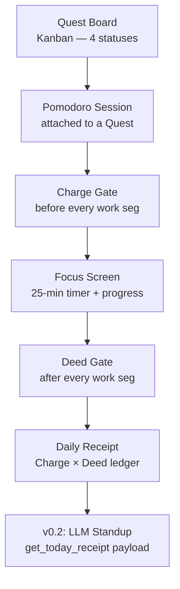

# Product Requirements Document
## QuestLog: Intentional Pomodoro

**Author:** Senior Product Engineer  
**Status:** Approved for Eng Review  
**Version:** 1.0  
**Last Updated:** April 7, 2026  
**Phase:** v0.1 (Charge/Deed loop) → v0.2 (LLM standup generation)

---

## TL;DR

QuestLog is a terminal-native personal productivity tool that combines a Kanban quest board with a structured Pomodoro timer. The core insight: **every productivity tool captures activity. None capture intention.** QuestLog closes that loop by collecting a micro-contract (Charge) before every focus block and a named outcome (Deed) immediately after — producing a structured, machine-readable work ledger that makes invisible work visible and becomes the backbone of AI-assisted reflection in v0.2.

---

## 1. Problem

### The Accountability Gap in Deep Work

Existing Pomodoro tools solve *scheduling* — they tell you when to focus and when to rest. They do not solve *accountability* — they cannot tell you what you decided to do, whether you did it, or how far intention drifted from execution.

At the end of a 10-pomo day, a developer sees: `🍅 × 10`. They feel productive. They cannot prove it. They cannot debrief it. They cannot learn from it.

This creates three compounding failure modes:

| Failure Mode | Manifestation | Cost |
|---|---|---|
| **Parkinson's Law** | Work expands to fill the pomo with no declared scope | Sessions drift; hard problems never reach closure |
| **Invisible Output** | Effort is logged, output is not | Standups, retros, and self-evaluation are reconstructed from heuristics |
| **No Calibration Loop** | Charge vs. Deed drift is never surfaced | Developers cannot improve their own estimation or execution patterns |

### Why Existing Tools Miss This

| Tool Category | What They Capture | What They Miss |
|---|---|---|
| Pomodoro timers (Forest, Be Focused) | Time blocks | Intention, outcome |
| Task managers (Linear, Notion) | Tasks and status | Sub-block granularity, real-time accountability |
| Time trackers (Toggl, Harvest) | Duration + project tag | Declared scope, per-block retrospective |
| Daily journals (Roam, Obsidian) | Free-form reflection | Machine-readable structure, in-flow capture |

There is a 25-minute window — the atomic unit of deep work — where no tool owns the before-and-after. QuestLog owns that window.

---

## 2. Why Now

**The standup gap:** LLM-assisted standup generation is table stakes in 2026. Every tool is racing toward it. The blocker is data quality — most tools feed the LLM `["worked on auth", "worked on auth", "worked on auth"]`. QuestLog's Charge/Deed ledger produces per-block semantic entries that are structurally suited to LLM summarization.

**The terminal professional resurgence:** Developer tooling is moving back to the terminal (LazyGit, k9s, Helix, Warp, Ghostty). A Textual-based TUI is not retro — it is the right form factor for a tool that lives alongside the editor, not competing with it for screen space.

**Zero-noise capture:** The tool runs in the terminal. The developer is already there. The friction to log is zero. The friction to skip the gate is intentionally non-zero. That asymmetry is only achievable in a tool that the user invokes themself.

---

## 3. Users

### Primary Persona: "The Deliberate Engineer"

A mid-to-senior individual contributor doing sustained deep work — feature development, debugging, architectural decisions. They are comfortable in the terminal. They have tried and abandoned at least two productivity apps. Their core frustration: **they do the work, but they cannot show the work, even to themselves.**

**Goals:**
- Maintain focus scope within a session
- Have something specific to say in standups without reconstructing memory
- Understand their own execution patterns (are they consistently over-scoping? Under-delivering relative to charge?)

**Non-user:** The manager or team lead tracking others' output. This product is a personal ledger, not a reporting tool. That boundary is load-bearing.

---

## 4. Goals and Success Metrics

### Goals

| ID | Goal |
|---|---|
| G1 | Every pomodoro has a declared Charge before it starts |
| G2 | Every pomodoro has a recorded Deed immediately after |
| G3 | A daily receipt is always visible and accumulated without manual effort |
| G4 | The receipt data is structurally ready for LLM consumption in v0.2 |
| G5 | The pomo panel is immersive — a full screen, not a modal overlay |

### Success Metrics (v0.1 — 30 days post-launch)

| Metric | Target | Rationale |
|---|---|---|
| **Charge completion rate** | ≥ 95% of started work segments have a non-null charge | Validates that the hard gate is not driving users to abandon sessions |
| **Deed completion rate** | ≥ 85% of completed work segments have a non-null deed | 15% tolerance for session-stop before deed submit |
| **Daily receipt entries per active day** | ≥ 3 charge/deed pairs | Confirms the tool is being used for real work blocks, not one-off tests |
| **Session abandonment rate** | < 10% increase vs. baseline | Hard gates should not significantly increase drop |
| **`[p]` receipt open rate** | ≥ 1x per day per active user | The receipt is valuable, not ignored |

### v0.2 Pre-condition (Gate Metric)

The LLM standup feature ships only when `get_today_receipt()` returns ≥ 3 entries for ≥ 70% of the user's working days over 2 weeks. Below that, the LLM has nothing meaningful to work with and the feature degrades trust.

---

## 5. Solution Overview

QuestLog is a Python/Textual TUI with two interconnected systems:



The **Quest Board** is the persistent task layer. The **Pomodoro session** is the ephemeral execution layer. The **Charge/Deed receipt** is the output layer — the permanent record that neither of the first two systems produces alone.

### The Core Interaction Loop

```
Before every pomo:   "What will you have forged when this 🍅 ends?"
After every pomo:    "What did you claim?"
```

These two questions, asked at the two natural pause points of every Pomodoro cycle, are the entire product surface. Everything else — the quest board, the receipt, the LLM hook — is infrastructure for these two questions.

---

## 6. Feature Deep Dive

### 6.1 The Charge Gate (Hard Constraint)

**Placed:** Immediately before the work timer starts, for every pomo in a multi-pomo run — not just the first.

**Design decision — hard gate, no skip:** A skippable gate becomes invisible in under two days. The friction is the feature. If a developer cannot name what they will forge in 25 minutes, the pomo should not start. This is the single most opinionated product decision in v0.1. It will drive the most pushback. It should not be softened.

**Wording:** *"What will you have forged when this 🍅 ends? (name the one thing — a fix, a decision, a draft)"*

- "Forged" is outcome-oriented, not activity-oriented. It primes the user toward deliverables, not effort.
- "The one thing" explicitly enforces single-scope. Parkinson's Law requires the user to negotiate a scope limit with themselves before they start.
- The parenthetical examples suppress blank-page anxiety without narrowing the answer.

### 6.2 The Deed Gate (Hard Constraint)

**Placed:** Between work timer firing and break starting. Break buttons are hidden until deed is submitted.

**Design decision — break hostage:** Holding the break behind the deed is more effective than a pre-break modal because it exploits the natural decompression desire. The user *wants* the break; completing the deed is the key. This is not dark pattern — the action is five words and takes fifteen seconds.

**Wording:** *"What did you claim? (a bug slain, a path cleared, a truth discovered)"*

- "Claimed" implies ownership and finality — the deed is yours, it happened, it is in the ledger.
- Past tense anchors to what happened, not what was attempted.
- Session stop with an un-submitted deed saves the segment as `deed_skipped: true` and excludes it from the receipt. The pomo still counts toward session metrics.

### 6.3 The Pomo Panel — Immersive Full Screen

**Promoted from:** `ModalScreen` overlay  
**Promoted to:** Full `Screen`

The panel uses a two-column layout:

| Left Column (Focus Zone) | Right Column (Daily Receipt) |
|---|---|
| `Digits` countdown timer | "📋 TODAY'S RECEIPT" header |
| `ProgressBar` (single, depletes during work) | `Rule` separator |
| `Static` percentage label | `RichLog` — scrollable, live-appending |
| "⚔ Your Charge" bordered zone (current pomo) | Appends after each deed submit |
| Journey track (lap history) | Re-populated from pomodoros.json on open |

The two-column layout is deliberate: the left column is ephemeral (this session, right now), the right column is accumulative (everything today). The user can see both simultaneously — their current charge and the ledger it will join.

### 6.4 Daily Receipt

The receipt is a named output. It is not a log file. It is the product.

Format per entry:
```
09:52  🍅 Auth Refactor
⚔  Squash the expiry bug in token middleware
✦  Bug squashed — one missing null check
```

- `⚔` = Charge (intention)
- `✦` = Deed (outcome)
- Two symbols per pomo makes charge-vs-deed drift instantly readable
- Only pairs with both fields appear. Incomplete entries are silently excluded — no failure states in the receipt view

**Accessibility from main board:** The stats bar always shows `📋 4 🍅 today  [p] view receipt`. The receipt is a `[p]` away whether a pomo is running or not.

### 6.5 Data Model

```json
{
  "type": "work",
  "lap": 2,
  "charge": "Squash the expiry bug in token middleware",
  "deed": "Bug squashed — one missing null check"
}
```

Two new fields on every work segment. String or null. Set at the two gate events. This is the entire data model change. The schema is additive — legacy entries with null charge/deed are backward compatible and simply excluded from the receipt.

---

## 7. What We Are Explicitly Not Building (v0.1)

| Non-Goal | Reason |
|---|---|
| LLM summarisation | Depends on receipt data quality; ships in v0.2 only after 2-week usage gate |
| Subtask checklists | Destroys single-scope discipline. The charge is one thing. |
| Export or sync | This is a personal ledger, not a team tool |
| Editing past entries | Immutability is a feature. The deed was what happened, not the revised narrative. |
| Per-quest subtask trees | Quest granularity lives at the quest board layer, not the pomo layer |
| Mobile / web | TUI-native is a positioning decision, not a limitation |

---

## 8. Technical Architecture

**Stack:** Python 3.12+, Textual (TUI framework), Rich (rendering), flat-file JSON persistence.

**Persistence model:** pomodoros.json is append-only by design. Sessions are written at start; segments appended as they complete. No database required. The data volume for a single developer (10 pomos/day, 250 working days) is ~2MB/year — trivially manageable in JSON.

**Key architectural constraints:**

- No new files. No new dependencies beyond what Textual already provides (`Digits`, `ProgressBar`, `RichLog`, `Rule` are all Textual builtins).
- `get_today_receipt()` is a pure read function over pomodoros.json. It is the v0.2 LLM payload interface — its schema is a public contract from day one.
- The `ChargeScreen` and `DeedScreen` are full `Screen` subclasses, not modals. State machine transitions are handled by the parent `PomodoroPanel` screen via `push_screen` / `pop_screen`.

**Widget upgrade map:**

| Before | After | Reason |
|---|---|---|
| Hand-rolled `Static` MM:SS | `Digits` | Purpose-built, accessible, no layout hacks |
| ASCII bar in `Static` | `ProgressBar` + `Static` (%) | Framework handles animation + theming |
| `Static` (daily log) | `RichLog` | Scroll, append, Rich renderables |
| Nothing between receipt entries | `Rule` | Semantic separator, visually clean |

---

## 9. Phasing

### v0.1 — The Accountability Loop (this spec)

**Scope:** Charge Gate + Deed Gate + Full pomo screen + Daily receipt log  
**Success gate:** Charge/deed completion rates, receipt open rate (see §4)  
**Timeline:** Single implementation sprint

### v0.2 — LLM Standup Generator

**Scope:** `[g]` keybind on `DailyReceiptModal` → calls LLM → renders 3-sentence standup + charge/deed drift analysis  
**Dependency:** v0.1 usage gate (≥3 receipt entries/day for ≥70% of working days over 2 weeks)  
**Interface contract:** `get_today_receipt()` already returns the exact payload. v0.2 is a consumer of v0.1 data, not a data-model change.

### v0.3 — Cross-Day Pattern Analysis

**Scope:** Charge-vs-deed drift trends over time. Which types of charges do you consistently over-scope? Which quests generate the highest deed quality?  
**Dependency:** Sufficient receipt data volume (4+ weeks of v0.1 usage)

---

## 10. Risks

| Risk | Severity | Mitigation |
|---|---|---|
| **Hard gate abandonment** — Users find the no-skip charge gate too restrictive and stop using the pomo feature | High | Monitor session abandonment rate. If >15% increase from baseline, introduce a single "skip with reason" option that still records `charge_skipped: true`. Do not soften to optional by default. |
| **Deed quality degradation** — Users submit one-word deeds to unlock the break ("done", "fixed", "ok") | Medium | Not a v0.1 launch blocker. v0.2 LLM analysis will naturally surface low-quality deeds. Min 3 characters enforced at input level. |
| **Receipt data loss** — pomodoros.json grows unbounded or is accidentally deleted | Low | JSON is local, readable, git-committable. V0.2 should add optional git-commit hook to checkpoint daily receipt. |
| **`Digits` widget sizing** — Textual's `Digits` widget requires careful CSS to size correctly in two-column layout | Low | Isolated to styles.tcss. No logic risk. |

---

## 11. Open Questions

| Question | Owner | Deadline |
|---|---|---|
| Should the charge field have a character limit? (too long = not "one thing") | Product | Before v0.1 implementation start. Recommendation: 120 chars soft limit, flag >80 with visual cue |
| Should `deed_skipped` segments appear in the receipt as "abandoned"? | Product | Before v0.1 launch. Current spec: silently excluded. A case exists for showing them as a failure signal. |
| What is the v0.2 LLM provider strategy? Local (Ollama) vs. API (OpenAI/Anthropic)? | Eng | v0.2 planning begins when v0.1 usage gate is met |
| Should the quest board be persistent across machine (sync)? | Product | V0.3+ only. Not relevant to v0.1. |

---

## 12. The One Thing This Product Is

Most productivity tools track that work happened. QuestLog tracks **what you decided to do and whether you did it**, at the atomic unit of deep work, in the moment it matters.

The receipt is not a feature. It is the product. Everything else — the quest board, the timer, the pomo panel — is infrastructure that makes the two-line entry possible:

```
⚔  What you said you would forge
✦  What you actually claimed
```

That gap — the delta between those two lines, accumulated across a day, a week, a quarter — is the most honest productivity data a developer can generate about themselves. No tool currently owns it. QuestLog does.

---
